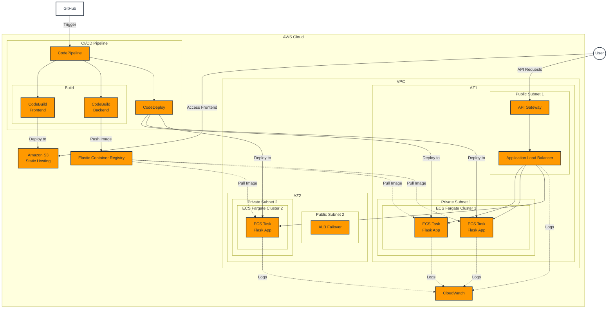

# Weather App Microservices

## Project Overview

The Weather App Microservices project is designed to deploy a weather application using a microservices architecture on AWS ECS with Docker. The project includes a Weather Data Service for fetching weather data from the National Weather Service (NWS) API, and a frontend interface hosted on S3. The services interact with AWS components like API Gateway, ECS, S3, and CloudWatch to deliver real-time weather data and a user-friendly interface.

## Table of Contents

1. [Project Overview](#project-overview)
2. [Try it Out](#try-it-out)
3. [Architecture](#architecture)
4. [Installation](#installation)
   - [Prerequisites](#prerequisites)
   - [Environment Setup](#environment-setup)
   - [Service Deployment](#service-deployment)
5. [Usage](#usage)
6. [Configuration](#configuration)
7. [Contributing](#contributing)
8. [License](#license)
9. [Contact Information](#contact-information)
10. [Architecture Diagrams](#architecture-diagrams)

## Try it Out

You can try out the live version of the web app using the following S3 link:

**[Weather App on S3](http://weather-info-app-frontend.s3-website.us-east-2.amazonaws.com/)**

## Architecture

### Architecture Diagram

The following diagram illustrates the high-level architecture of our Weather App Microservices:

This diagram showcases the key components of our weather application, including:

- Frontend hosted on S3
- API Gateway for managing and routing requests
- ECS Fargate clusters running our microservices across multiple Availability Zones
- Application Load Balancer for distributing traffic
- CI/CD pipeline for automated builds and deployments
- CloudWatch for monitoring and logging

### Microservices

- **Weather Data Service**: Fetches weather data from the National Weather Service (NWS) API and provides it via a RESTful API.
- **API Gateway**: Manages and routes requests to the appropriate microservice, handling integration with ECS services.

### AWS Services

- **ECS**: Manages Docker containers with Fargate for serverless container management.
- **S3**: Hosts static assets for the frontend.
- **CloudWatch**: Monitors and logs ECS tasks and ALB.
- **ECR**: Stores Docker images for our microservices.
- **CodePipeline, CodeBuild, CodeDeploy**: Manages the CI/CD pipeline for automated deployments.

### External Integration

- **National Weather Service API**: Used for fetching weather data.

## Installation

### Prerequisites

- AWS Account with appropriate permissions.
- AWS CLI installed and configured.
- Docker installed on your local machine.
- Python 3.x for backend development.
- Node.js for frontend development.

### Environment Setup

1. **AWS Setup**:

   - Create IAM users and groups with necessary permissions.
   - Set up VPC, subnets, and security groups as shown in the architecture diagram.

2. **ECS Setup**:

   - Create ECS clusters using Fargate in both Availability Zones.
   - Define and deploy the task definitions for the Weather Data Service.

3. **ECR Setup**:

   - Create ECR repositories for the backend microservice.

4. **Frontend Setup**:

   - Create a React application and configure it to interact with the backend API.
   - Set up S3 bucket for static website hosting.

5. **CI/CD Setup**:
   - Set up CodePipeline with separate stages for frontend and backend.
   - Configure CodeBuild projects for building frontend and backend.
   - Set up CodeDeploy for ECS deployments.

### Service Deployment

1. **Deploy Weather Data Service**:

   - Build and push Docker images to ECR.
   - Deploy the service using ECS and configure networking.

2. **Frontend Deployment**:

   - Build the frontend and deploy to S3 using the CI/CD pipeline.

3. **CI/CD Pipeline**:
   - Ensure the pipeline is triggered on commits to the main branch.
   - Verify that frontend changes are deployed to S3 and backend changes trigger new ECS task deployments.

## Usage

- **Accessing the Frontend**:

  - The frontend is hosted on S3 and accessible via the public URL provided in the "Try it Out" section.

- **Interacting with the API**:
  - Use the API Gateway to route requests to the appropriate microservice.
  - Example: `http://<api-gateway-url>/weather?lat=38.8894&lon=-77.0352`

## Configuration

- **API Gateway Configuration**: Configure the API Gateway to route requests to the ALB.
- **Environment Variables**: Manage configurations for different environments (development, staging, production) using environment variables in ECS task definitions.
- **Docker Configuration**: Configure Docker containers, including exposed ports, environment variables, and volumes in the task definitions.
- **Load Balancer**: Configure health checks and routing rules in the Application Load Balancer.

## CI/CD Pipelines

### CI/CD Workflow

To streamline the development process and ensure that changes to your frontend and backend are automatically deployed, we have set up a CI/CD pipeline using AWS CodePipeline, CodeBuild, and other AWS services:

- **Pipeline Stages**:

  1. **Source Stage**: Pulls code from the GitHub repository.
  2. **Build Stage**: Builds the frontend and backend. The frontend is built using Vite, and the backend is containerized using Docker.
  3. **Deploy Frontend**: Syncs the built frontend assets to the S3 bucket.
  4. **Deploy Backend**: Deploys the new Docker image to ECS, automatically updating the service.

- **Key Points**:
  - The ALB is used to route traffic to the ECS service, ensuring that changes in task IPs do not affect the API Gateway.
  - The pipeline ensures that both the frontend and backend are always up to date with the latest changes pushed to the repository.

## Contributing

Contributions are welcome! Please follow these guidelines:

1. Fork the repository.
2. Create a new branch for your feature or bug fix.
3. Make your changes and ensure all tests pass.
4. Submit a pull request with a detailed description of your changes.

## License

This project is licensed under the MIT License. See the LICENSE file for details.

## Contact Information

For questions, comments, or support, contact [gudivadarahul@gmail.com].
